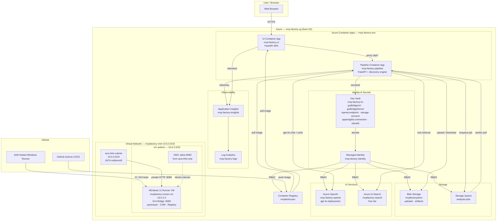

# Architecture

## Azure Architecture Diagram

## Goal
Generate an MCP server/tool schema from existing binaries (DLL/EXE/CLI/repo) by discovering invocable surfaces, normalizing them, enriching metadata, and generating deployable MCP components.

## Pipeline (high level)
1. Acquire target (file upload or installed path)
2. **Hybrid Classification & Routing**
   - Detects all capabilities: Native Exports (`.dll`), COM Server (`HKCR`), .NET Assembly (`CLR`), CLI Tool (`.exe`)
   - Supports multi-paradigm files (e.g., `shell32.dll` = COM + Native)
3. Discover invocable surfaces (exports/help/registry/etc.)
4. **Score confidence** in each surface (4-factor analysis; label derived after data is measured)
5. **Strict Artifact Generation**
   - Output normalized MCP JSON (`*_mcp.json`) using flat invocable contract
   - Suppress empty/invalid outputs ("Silence is Golden")
6. User selects subset -> `selection.json`
7. Generate MCP tools/server + deploy verification instance
8. Verify via chat UI + downloadable outputs

## Components

### Discovery Layer
- **Hybrid Routing Engine** (Section 2-3)
  - `main.py`: Capabilities-based router (Fall-through logic)
  - Handles `hybrid` files (e.g., `notepad.exe` as CLI + COM, `shell32.dll` as Native + COM)
  
- **DLL Export Analysis**
  - `pe_parse.py`: Pure Python import/export extraction (via `pefile`)
  - `exports.py`: Demangling, forwarding, deduplication
  - `headers_scan.py`: Prototype extraction from C/C++ headers (98% match rate)
  - Outputs: MCP JSON (Tier 2-4), Metadata (Tier 5)

- **COM & .NET Analysis**
  - `com_scan.py`: Recursively scans registry for CLSIDs/TypeLibs
  - .NET reflection (System.Reflection) for managed assemblies (future)
  
- **CLI Help Scraper** (future)
  - Parse --help / -h output
  - Extract subcommands and parameters

### Quality & Confidence Layer
- **Confidence Scoring** (new, 2026-01-21)
  - `score_confidence(export, matches, is_signed, forwarded) -> (level, reasons)`
  - 6 factors: header_match, doc_comment, signature_complete, parameter_count, return_type, non_forwarded
  - Tiers: HIGH (≥6), MEDIUM (≥4), LOW (<4)

- **Strict Artifact Hygiene** (new, 2026-01-27)
  - **Noise Suppression**: Files with 0 found features generate NO output
  - **Redundancy Removal**: Deprecated legacy `.json`, standardized on `*_mcp.json`
  - Ensures downstream tools never encounter "Ghost Tools"

### Setup & Automation Layer
- **Boot Checks** (new, 2026-01-21)
  - Pre-flight validation: repo root, Python 3.8+, Git, PowerShell 5.1+
  - Indicators: [+] (pass, green), [-] (fail, red)
  - Fail-fast on missing prerequisites
  
- **Frictionless Deployment** (scripts/)
  - `scripts/setup-dev.ps1`: One-command setup with auto-detection
  - `scripts/run_fixtures.ps1`: Robust path resolution (3-method fallback), vcpkg bootstrap
  - Auto-detects dumpbin, Visual Studio, vcpkg
  - Tested on clean machines (no pre-installed tools)
  
### Schema & Output
- `schema.py`: Invocable dataclass (name, ordinal, signature, confidence, doc)
  - Writers: CSV, JSON, Markdown
  - Supports 5-tier output (exports only → metadata-rich)

### Integration Points
- **Section 4 (MCP Generation)**: Consumes confidence metadata
  - HIGH confidence → auto-generate MCP tool definitions
  - MEDIUM confidence → auto-generate + flag for review
  - LOW confidence → skip or require manual spec
  
- **Future LLM Integration**: Confidence metadata helps Claude/GPT prioritize trustworthy exports
- **Section 5 (UI)**: Displays confidence breakdown, allows filtering by confidence tier

## Design Decisions

| Decision | Rationale | Reference |
|----------|-----------|-----------|
| Modular 8-module architecture | Enable team parallelization, testability, feature expansion | ADR-0002 |
| Confidence scoring with color | Transparency + quality signal + Section 4 prioritization | ADR-0003 |
| Frictionless one-command setup | Reproducibility, professional signal, user empathy | ADR-0003 |
| Header matching for signatures | 98% accuracy enables high-confidence auto-wrapping | Iteration 1 results |
| 5-tier output model | Gradual enrichment; supports various downstream needs | MVP analysis |

## Open Questions
- How to handle confidence in .NET reflection (Section 3)?
- Should users override confidence scores?
- Integration with external documentation sources?
- Semantic analysis (infer safety from function names)?

