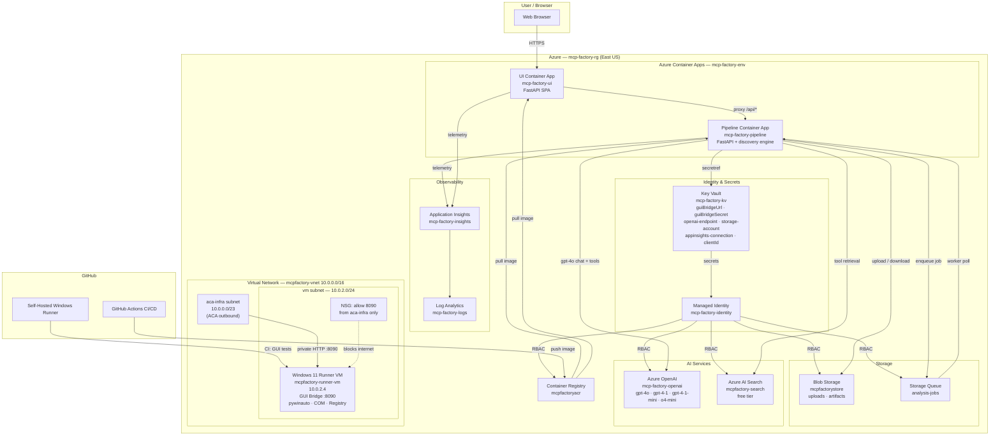

# Azure Infrastructure Reference

> Migrated from docs/architecture.md (now deleted).
> This is the Azure resource map and blob registry for the pipeline.

---

## Azure Architecture

---

## Blob Registry

Each job writes to the `artifacts` container under `{job_id}/`. The `uploads` container holds raw binaries.

| Blob key | Written by | Consumed by | Contains |
|----------|-----------|-------------|---------|
| `uploads/{job_id}/input{suffix}` | `/api/analyze` upload | explore worker | Raw binary (DLL/EXE) |
| `{job_id}/status.json` | API pipeline (all stages) | UI polling, session snapshot | Job status, explore_phase, gap_count, question_count |
| `{job_id}/mcp_schema_t0.json` | `generate.py` | Session diff, schema_evolution.json | Pre-explore baseline schema |
| `{job_id}/mcp_schema.json` | `generate.py` → patched by `_patch_invocable` | Chat as tool definitions, session snapshot | Enriched OpenAI function-calling schema |
| `{job_id}/invocables_map.json` | `generate.py` → enriched by explore | `executor.py`, backfill, gap resolution, chat | Full invocable registry with criticality, depends_on, param names |
| `{job_id}/vocab.json` | `explore_vocab.py` during probe, gap answers on refine | Chat system message, explore system message | id_formats, value_semantics, error_codes, notes, description |
| `{job_id}/findings.json` | `_save_finding` (append) / `_patch_finding` (update) | Chat system message, synthesis, backfill | Per-function probe results, working calls, status |
| `{job_id}/static_analysis.json` | `static_analysis.py` phase-0 | Session ZIP, explore system prompt hints | PE version, IAT capabilities, binary strings, Capstone sentinels |
| `{job_id}/api_reference.md` | `_synthesize` phase-6 | Backfill (LLM input) | Synthesized human-readable API doc — NOT in chat context |
| `{job_id}/behavioral_spec.py` | `_synthesize` phase-6 | Human reference only | Typed Python stub — NOT in chat context |
| `{job_id}/sentinel_calibration.json` | explore phase-1 | Diagnostic script, T-02 transition check | Calibrated sentinel code map |
| `{job_id}/gap_resolution_log.json` | `_attempt_gap_resolution` + mini-sessions | Session snapshot, diagnostic script | Per-function gap resolution attempts and outcomes |
| `{job_id}/harmonization_report.json` | finalize phase | Session snapshot | Function outcome consistency summary |
| `{job_id}/session-meta.json` | Pipeline (all phases) | `collect_session.py`, contract evaluation | Required contract file: job_id, component, phases, timestamps |
| `{job_id}/stage-index.json` | Pipeline (each stage exit) | `collect_session.py`, transition evaluator | Required contract file: per-stage status, artifacts, checks |
| `{job_id}/transition-index.json` | `cohesion.py` evaluator | `collect_session.py`, CI gate | Required contract file: T-01..T-16 status, severity, detail |
| `{job_id}/cohesion-report.json` | `cohesion.py` evaluator | `collect_session.py`, CI gate, DASHBOARD.md | Required contract file: hard_fail, pipeline_verdict, totals |

### What chat actually sees

Only these two blobs are injected into the chat system message (loaded once at turn 0):
1. `vocab.json` → `_vocab_block()` → vocab section in system prompt
2. `findings.json` → `_load_findings()` → findings section in system prompt

NOT loaded into chat: `api_reference.md`, `behavioral_spec.py`, `mcp_schema.json` (client sends tools in POST body), `static_analysis.json`.

---

## Container App URLs

| Service | URL |
|---------|-----|
| Pipeline API | `https://mcp-factory-pipeline.icycoast-8ddfa278.eastus.azurecontainerapps.io` |
| UI | `https://mcp-factory-ui.icycoast-8ddfa278.eastus.azurecontainerapps.io` |
