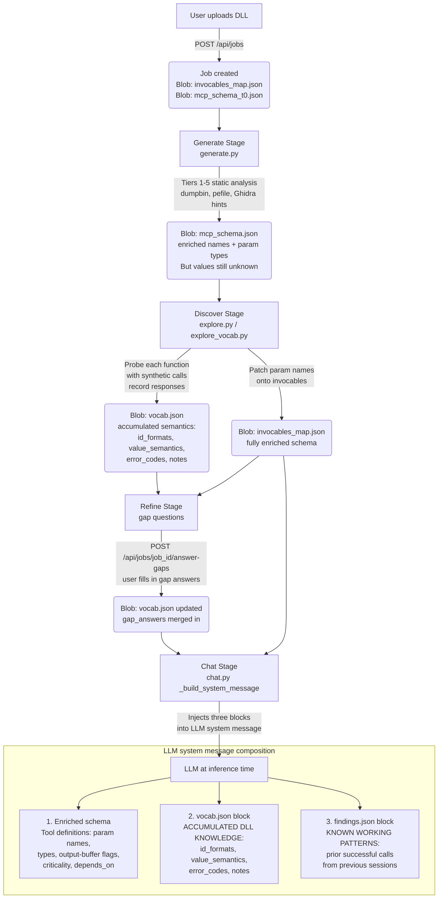

# MCP Factory – Pipeline Architecture

> AI orientation reference. Read this before reading any session's SUMMARY.md.

---

## Full Pipeline Flow



---

## What Each Blob Does

| Blob | Built by | Consumed by | Contains |
|---|---|---|---|
| `mcp_schema_t0.json` | explore.py (pre-enrichment snapshot) | sessions/schema/ reference | Baseline schema before any discovery |
| `mcp_schema.json` | generate.py → explore.py patches | chat.py as tool definitions | Enriched: param names, types, output-buffer flags |
| `invocables_map.json` | generate.py → explore.py patches | chat.py, executor.py | Full invocable registry with criticality + depends_on |
| `vocab.json` | explore_vocab.py (during discover) + gap answers | chat.py system message | Semantic knowledge: id formats, value meanings, error codes |
| `findings.json` | chat.py record_finding calls | chat.py system message | Working call patterns from live sessions |

---

## System Message Composition (actual injection order)

```
┌───────────────────────────────────────────────────────────────────┐
│  LLM System Message  (token position = priority)                  │
│                                                                   │
│  ① DOMAIN PREAMBLE  ← FIRST, before any rules                   │
│    COMPONENT BEING CONTROLLED:                                    │
│      <synthesized one-sentence description>                       │
│      Integration intent: <user_context / use_cases>               │
│    Source: vocab["description"] + vocab["user_context"]           │
│                                                                   │
│  ② MECHANICAL RULES (1–7)                                        │
│    Batching, output-buffer omission, error probing, etc.          │
│    init_rule + criticality_block                                  │
│                                                                   │
│  ③ VOCAB BLOCK (priority-ordered)                                │
│    1. id_formats    — wrong format = every call fails             │
│    2. error_codes   — interpret every response                    │
│    3. value_semantics — parameter and return meanings             │
│    4. notes         — cross-function observations                 │
│    5. everything else                                             │
│    Source: vocab.json minus description/user_context              │
│                                                                   │
│  ④ FINDINGS BLOCK  ← LAST (most trusted, most specific)         │
│    KNOWN WORKING PATTERNS from prior sessions                     │
│    "this exact call produced this output"                         │
└───────────────────────────────────────────────────────────────────┘
```

**Rule of thumb:**  
Schema answers "what do I call and how do I call it?"  
vocab.json answers "what values do I pass?"  
findings.json answers "what has already been proven to work?"  
description/user_context answers "what IS this thing I'm controlling?"

---

## vocab.json Structure (live example)

```json
{
  "description":   "Customer loyalty management system handling orders, balances, refunds, and tier tracking.",
  "user_context":  "Legacy CRM DLL used by the payments team — needs wrapping for new microservice.",
  "id_formats":    ["CUST-NNN", "LOCKED", "ORD-YYYYMMDD-NNNN"],
  "value_semantics": {
    "Returned":    "Success indicator — 0 means successful refund processing",
    "balance":     "Balance in cents — divide by 100 to get dollar amount",
    "param_4":     "Refund amount in cents — divide by 100 to get dollars",
    "tier":        "Loyalty tier — membership level of the customer"
  },
  "error_codes": {
    "0xFFFFFFFB":  "Write denied",
    "0xFFFFFFFC":  "Account locked"
  },
  "notes": "Order IDs follow the format ORD-YYYYMMDD-NNNN",
  "write_blocked_by": "Sentinel error codes indicating write denied"
}
```

`description` is synthesized at the end of the Discover stage by the LLM from
accumulated semantics + `user_context`. `user_context` is the verbatim `use_cases`
field the developer enters at job creation — it persists through to chat time.

vocab.json grows incrementally as each function is probed. The explore stage
runs functions with synthetic inputs, observes outputs, and infers semantics.
Gap answers (user-supplied) are merged on top during the Refine stage.

---

## Context Prioritization (implemented 2026-03-17)

The system message is now structured so the most important context appears at
earlier token positions, which LLMs weight more heavily:

1. **description + user_context** — hoisted BEFORE the rules in `_build_system_message()` 
   so the model reads domain framing before any mechanics. Sourced from `vocab["description"]`
   (LLM-synthesized at end of Discover) and `vocab["user_context"]` (verbatim from the
   developer's `use_cases` field at job creation).

2. **_vocab_block() priority order** — rewritten in `explore_vocab.py`:
   `id_formats` → `error_codes` → `value_semantics` → `notes` → everything else.
   description/user_context are stripped from vocab_block in chat (already hoisted).

3. **description synthesis** — at the end of `_explore_worker()`, if `vocab["description"]`
   doesn't exist yet, one cheap LLM call generates a ≤25-word domain sentence from
   accumulated value_semantics + id_formats + user_context seed.

**Fallback behaviour:** if the user provides no `use_cases` and the DLL has no
discoverable strings, `description` is synthesized purely from probing results.
A blank description is acceptable — the vocab block still provides full context.
The system never fails on missing domain framing.
